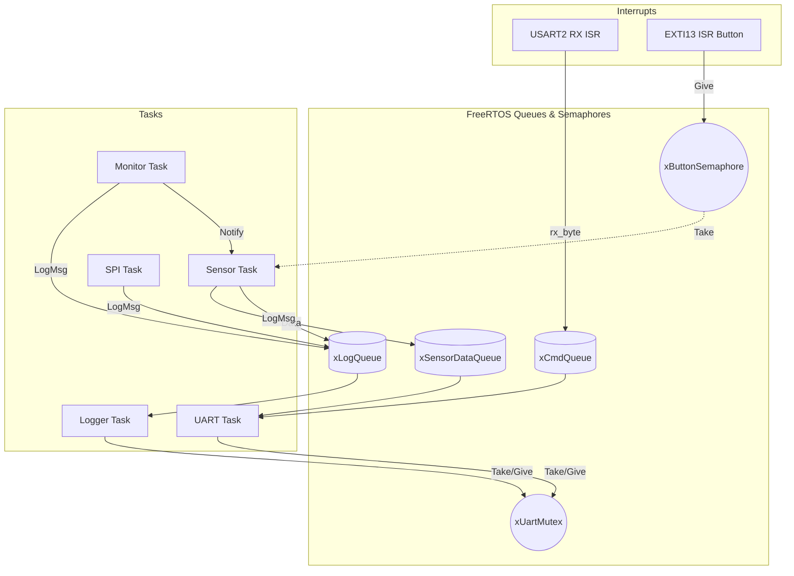

# FreeRTOS-Based Embedded Monitoring System

This project is an embedded monitoring system built on the STM32 NUCLEO-F446RE development board. It uses FreeRTOS to manage multiple concurrent tasks, handle sensor acquisition, and provide a command-line interface over UART.

This was developed as an educational project to practice real-time operating system concepts and embedded firmware design.

---

## Features

- **Multi-threaded Architecture**: 5 distinct FreeRTOS tasks (Sensor, SPI, UART, Monitor, Logger).
- **Preemptive Priority Scheduling**: Organizes tasks so that critical health monitoring runs reliably.
- **Interrupt-Driven CLI**: Uses UART receive interrupts alongside an RTOS queue to allow interactive commands without blocking system tasks.
- **Thread-Safe Logging**: A dedicated logger task and mutex protect the UART transmission, preventing interleaved console text.
- **Event-Driven Processing**: A physical button press triggers a GPIO EXTI interrupt, using a binary semaphore to wake the sensor task immediately.
- **System Health Monitoring**: A monitor task routinely checks heap usage and uses direct task notifications to verify that other tasks are responsive.

---

## System Architecture



---

## Task Structure

| Task | Priority | Stack (Words) | Purpose |
|------|----------|---------------|---------|
| **Monitor Task** | 4 (Highest) | 256 | Sends task notifications for health pings; logs free heap. |
| **UART Task** | 3 | 512 | Parses CLI input (`xCmdQueue`); retrieves sensor/SPI data. |
| **Sensor Task** | 2 | 256 | Reads temperature every 1s OR on button press. |
| **SPI Task** | 2 | 256 | Simulates SPI transaction every 2s. |
| **Logger Task** | 1 (Lowest) | 256 | Dequeues from `xLogQueue` and prints to terminal. |

---

## Build Instructions

This project is built using the standard ARM GNU Toolchain and STM32CubeIDE.

1. Import the project folder into STM32CubeIDE.
2. Build Project (Release or Debug).
3. Connect the NUCLEO-F446RE via USB.
4. Run -> Debug As -> STM32 C/C++ Application.
5. Open a Serial Terminal (e.g., PuTTY, TeraTerm) connected to the ST-Link Virtual COM port at **115200 baud**.

---

## Demonstration

**CLI Session:**
```text
=============================================
  FreeRTOS Embedded Monitoring System v2.0.0
  Target: STM32F446RE (NUCLEO Board)
  Author: Somya Bhadada
=============================================

Type 'help' for available commands.
> help

Available Commands:
  help / h      - Show this help menu
  status / s    - System status and task info
  version / v   - Firmware version and build date
  sensor / r    - Read latest sensor data
  spi           - Read latest SPI peripheral data
  clear / cls   - Clear terminal screen

> 
[SENSOR] Periodic read #1: 25.1 C
[MONITOR] Free Heap: 12280 bytes
[SPI] Transaction 1 completed. Val: 0
> sensor

Sensor: 25.1 C (at 1000 ms)
```

---

## Future Improvements

1. **Hardware Integration**: Replace the virtual sensor implementation with an actual BME280/MPU6050 sensor via I2C/SPI.
2. **DMA**: Upgrade UART RX to use Circular DMA with Idle Line Detection for processing variable-length command strings.

---

## Acknowledgments and License

- Project maintained by Somya Bhadada.
- Based on foundational embedded code structures originating from `karangandhi-projects` (MIT License). 
- STM32 HAL is licensed under BSD-3-Clause by STMicroelectronics.
- FreeRTOS kernel is licensed under the MIT License by Amazon.com.
