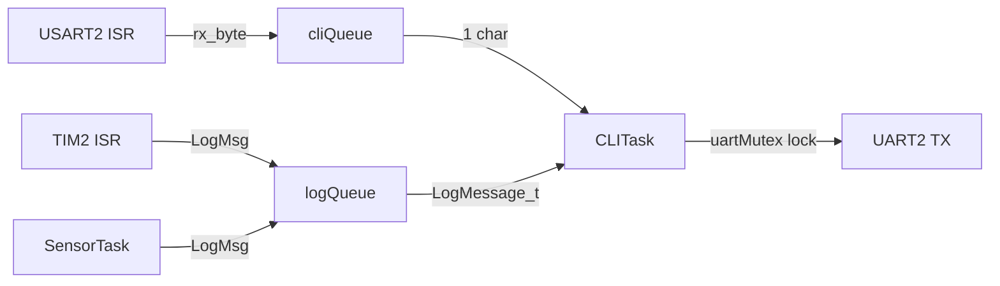
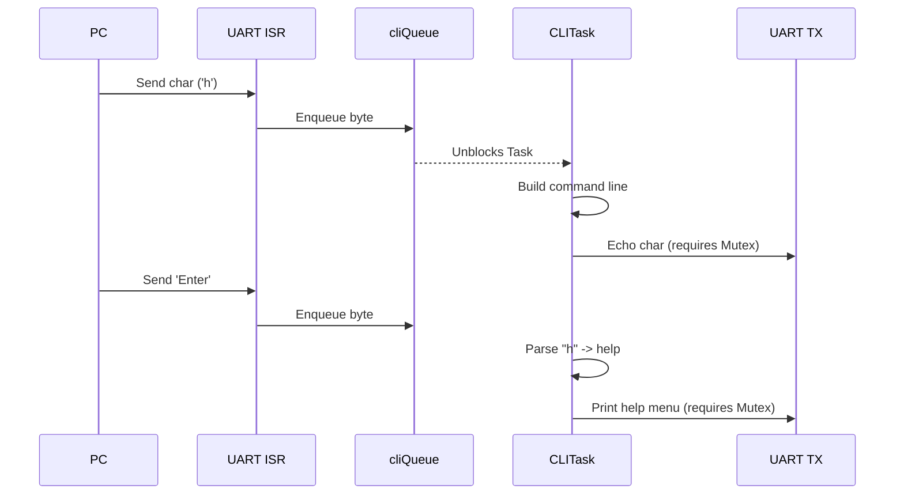
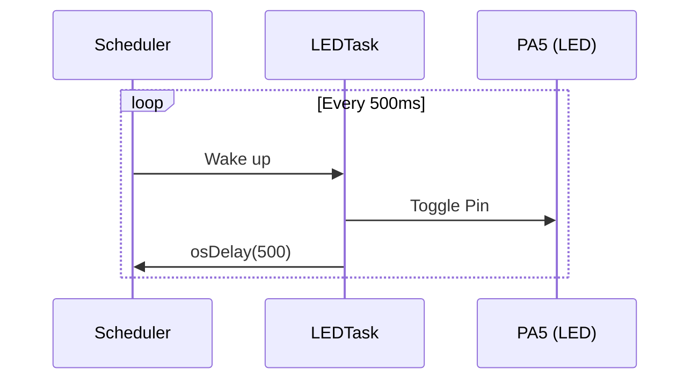

# Architecture Analysis

## 1. System Boot Execution Flow
The system boot sequence follows a standard STM32 initialization path before handing over control to the FreeRTOS scheduler.

```mermaid
graph TD
    A[Reset_Handler (Assembly)] --> B[SystemInit (Clock Setup)]
    B --> C[main.c]
    C --> D[HAL_Init]
    D --> E[SystemClock_Config]
    E --> F[Peripheral Init: GPIO, USART2, TIM2]
    F --> G[osKernelInitialize]
    G --> H[RTOS Object Creation: Queues, Mutex]
    H --> I[Task Creation]
    I --> J[HAL_UART_Receive_IT (Enable RX)]
    J --> K[osKernelStart (Scheduler starts)]
    K --> L[Tasks running based on priority]
```

## 2. FreeRTOS Scheduler Behavior
- **Type**: Preemptive scheduler.
- **Tick Rate**: 1000 Hz (1 ms tick resolution).
- **Execution**: The scheduler guarantees that the highest priority task in the "Ready" state is the one currently executing. Time-slicing is enabled for tasks of equal priority.

## 3. Task Relationships and Communication
The original architecture defines three tasks and uses two queues for inter-process communication (IPC).



## 4. Queue and Mutex Usage
- **cliQueue**: A 32-element queue of `uint8_t`. It decouples the fast interrupt context of UART RX from the slower processing of the `CLITask`.
- **logQueue**: A 16-element queue of `LogMessage_t`. Used to funnel logging statements from multiple sources to a single consumer (`CLITask`) to prevent console spam and interleaved text.
- **uartMutex**: A FreeRTOS mutex used inside `uart_print()`. It prevents tasks from simultaneously calling `HAL_UART_Transmit` and scrambling the terminal output.

## 5. ISR Interactions
1. **UART RX**: When a byte arrives, the ISR `HAL_UART_RxCpltCallback` executes. It uses `osMessageQueuePut` to enqueue the byte to `cliQueue` without blocking, then re-arms the interrupt.
2. **TIM2**: The periodic timer fires `HAL_TIM_PeriodElapsedCallback`. If logging is enabled, it generates a log string and pushes it to `logQueue` via a non-blocking put.

## 6. Execution Flow (UART and GPIO)

### UART Flow


### GPIO Flow
The LED toggling is purely task-driven in the original system.

